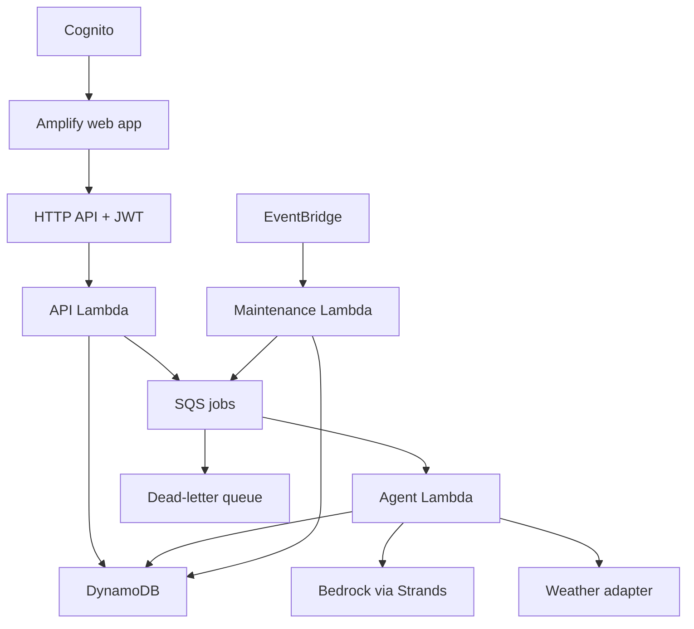

# AWS architecture

## Chosen stack

| Layer | Choice | Purpose |
|---|---|---|
| UI | React, TypeScript, Vite, Tailwind | Operations screen and mobile action view |
| Hosting | Amplify Hosting | HTTPS frontend and reproducible deployment |
| Identity | Cognito user pool and API Gateway JWT authorizer | Presenter/supervisor access |
| API | API Gateway HTTP API + Python Lambda | Short reads and validated commands |
| Work queue | SQS standard queue + DLQ | Run agent jobs outside request timeouts |
| Agent | Python Lambda, Strands, Amazon Bedrock | Bounded tool-use planning |
| State | DynamoDB on-demand | Sites, runs, revisions, tasks, audit, queue recovery |
| Timers | EventBridge scheduled rule + maintenance Lambda | Dispatch repair, expired leases, overdue tasks |
| Observability | CloudWatch logs, metrics, alarms | Run evidence and operational failures |
| Infrastructure | AWS CDK TypeScript | Repeatable infrastructure, outputs, least privilege |

Default application region: ap-south-1. `BEDROCK_REGION` and `BEDROCK_MODEL_ID` are explicit deployment configuration, verified with a real tool-use invocation in T00. Prefer a supported tool-capable Amazon Nova model if available in the account; otherwise use an enabled Bedrock model or profile. Do not assume an exact model identifier, access, or cross-region permission. Pin the working selection after the smoke test.

Use Python for the agent and API to share Pydantic domain contracts and scheduling functions. Vansh's Java strength is useful for design, but introducing a second backend language would slow this two-day build.

## Topology

CloudWatch receives structured logs from each Lambda. The diagram deliberately omits optional email, maps, AgentCore, Step Functions, RAG, and VPC networking.

## Request and job lifecycle

1. Authenticated `POST /runs` validates site ownership and creates a run plus a dispatch record in one DynamoDB transaction. An idempotency record maps the caller's key to that run.
2. API attempts `SendMessage`. On success mark dispatch `SENT`; on failure leave `PENDING`. Either way a durable accepted run returns 202 with `dispatchStatus`; the UI says queued, never complete.
3. Maintenance queries pending dispatches and re-enqueues them. A send-success/update-failure can enqueue twice; the worker must tolerate this.
4. Worker claims the run with a conditional lease. Completed runs and active leases make duplicate deliveries no-ops. Every successful claim increments a fencing token; subsequent writes require that token so an expired worker cannot overwrite a newer attempt.
5. Worker captures immutable site, forecast, and policy versions; runs bounded tool calls; stores events, validated candidate selection, and a proposed revision.
6. API polling returns saved events, status, and proposal. Browser disconnect does not cancel work.
7. Approval is a transaction conditional on current run, site version, forecast version, policy version, proposal hash, and proposal status. It writes approval, published coordination tasks, and audit event atomically. Fixed task count remains small in P0.
8. No Lambda waits for human approval. Approval, acknowledgments, and follow-up are separate requests or timer invocations.

## Reliability settings to implement

- API timeout target: 15 seconds; never wait for an agent result in a request.
- Agent Lambda timeout: 180 seconds; application deadline: 120 seconds with time reserved for cleanup. Set per-call model/network timeouts and bounded retries inside that budget.
- Queue visibility: 1080 seconds, based on six times the Lambda timeout; batch size 1, redrive maxReceiveCount 3, worker event-source maximum concurrency 2. Confirm account quotas before setting reserved concurrency.
- Initial claim lease: 240 seconds. Maintenance detects abandoned RUNNING jobs after lease expiry, checks retry budget, and conditionally requeues; old workers are fenced out. Increment attempt on claim, maximum 3 claims, then terminal failure.
- Maintenance runs each minute; queries dispatch work, lease expiry, and due actions through indexes. Bound pages per tick and expose lag.
- Retriable errors log an attempt and allow SQS retry; schema errors or irrecoverable inputs become FAILED and are acknowledged. Explicit INSUFFICIENT_DATA can finish without a proposal.
- Conditional terminal writes prevent duplicate proposal publication. Audit event keys use deterministic operation IDs for retry-safe events.
- Browser polls every 2 seconds while active, 10 seconds for action follow-up, and stops on terminal states or hidden tab.
- GSI reads are eventually consistent; mutation gates use strongly consistent primary reads plus transactional version conditions.

## Authorization and demo separation

All `/sites`, `/runs`, `/plans`, `/tasks`, and mutating `/demo/sessions` routes require Cognito JWTs. Server maps Cognito subject to the organization and roles; it never trusts an organization ID supplied by the browser. Seed an operations lead and a supervisor with access to the fixture site.

Public route: `GET /demo/replays/{id}` returns only a sanitized, explicitly published immutable replay. It cannot invoke Bedrock, reset data, change time, acknowledge tasks, or send messages. Reviewer landing screen offers this replay without sign-in; the video demonstrates authenticated execution.

`POST /demo/sessions/{id}/advance-clock` is allowed only for an owned synthetic session. It calls the same overdue evaluator with an injected clock. Live-mode sessions use server UTC and reject that operation. Keep scenario and real execution timestamps distinct.

No public API secrets in Vite variables. Only public API base URL, Cognito IDs, and region belong there. Use Cognito managed login with authorization code + PKCE. Resolve SDK details at implementation time.

## Data retention and costs

No health records or real worker identifiers in the demo. Store crews and synthetic role names. Keep raw weather snapshots bounded within item-size limits; store compact hourly arrays, not provider response dumps. Large replay export is a later S3 addition if needed.

Use a seven-day log retention setting, task TTLs appropriate for ephemeral demo sessions, and cleanup commands. TTL is eventual deletion, never a deadline evaluator or authorization check.

Set an AWS Budget alert and application invocation limits. Budget alerts do not enforce a hard stop. Limit two agent runs per minute per user, one active run per site/session, and 100 agent runs per demo organization per day initially. Report the actual measured cost after rehearsals; no invented cost estimate or credit balance.

## Why this is enough

The async queue addresses model latency; DynamoDB stores the source of truth; transactional approval prevents publishing stale work; one timer handles recovery and overdue checks. The MVP does not need distributed multi-agent orchestration, a vector store, Kubernetes, or a long-running workflow engine.
